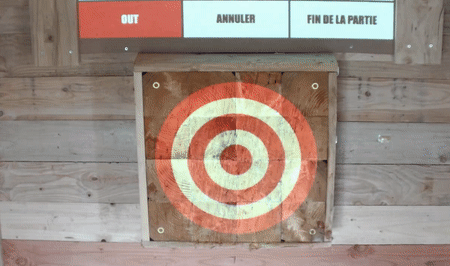

## **Introduction**

The **`DetectionManager`** class in this Python script is used for detecting specific objects in a video source and transform their centers to another coordinate system. It uses the **`YOLO`** (You Only Look Once) model from the **`ultralytics`** package, a real-time object detection system, to detect objects in each frame of the video source. The script specifically focuses on two types of objects: axes and squares. There are two separate YOLO models trained for detecting each type of object.

## **How it Works**

### **Initialization**

When an instance of the **`DetectionManager`** class is created, it is initialized with the file paths of the YOLO models for axes and squares, the device to run the model, and the source of the video (file path or 0 for camera).

### **Calibration**

Before starting the detection loop, the **`calibrate`** method is called to compute the transformation matrix. It reads frames from the video source, predicts squares in the frame using the square model, and computes the transformation matrix using the centers of the detected squares. The transformation matrix is used to transform the centers of the detected axes from the video coordinate system to another coordinate system.

### **Detection Loop**

The **`detection_loop`** method reads frames from the video source, predicts axes in the frame using the axe model, and transforms the centers of the detected axes using the transformation matrix computed during the calibration. It also tracks the detected axes using the **`supervision`** package and filters the results to keep only the axes whose centers do not change significantly between consecutive frames. This is done to filter out false positive detections.

### **Starting and Stopping the Detection**

The **`start_detection`** method sets a flag **`detection_running`** to **`True`** and starts the **`detection_loop`**. The **`stop_detection`** method sets the **`detection_running`** flag to **`False`**, which stops the **`detection_loop`**.

## **Utility Methods**

- **`_get_centers`**: This method takes the results of the YOLO model prediction and returns the centers of the bounding boxes of the detected objects.
- **`_calculate_transformation_matrix`**: This method takes the centers of the detected squares and computes the transformation matrix.
- **`_handle_results`**: This method takes the results of the YOLO model prediction and the history of the tracked axes, and returns the results that correspond to the axes whose centers do not change significantly between consecutive frames.
- **`_draw_and_transform_results`**: This method takes the results that correspond to the axes whose centers do not change significantly between consecutive frames, draws the bounding boxes of the detected axes on the frame, transforms the centers of the detected axes using the transformation matrix, and sends the transformed centers to the JavaScript (JS) side using the **`eel`** package.

## **Main Function**

In the **`main`** function, an instance of the **`DetectionManager`** class is created with the file paths of the axe and square models, the device to run the model, and the source of the video. Then, the **`calibrate`** method is called to compute the transformation matrix, and the **`start_detection`** method is called to start the detection loop.